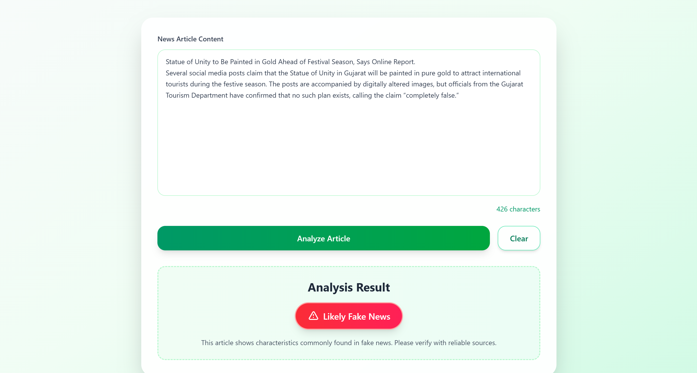
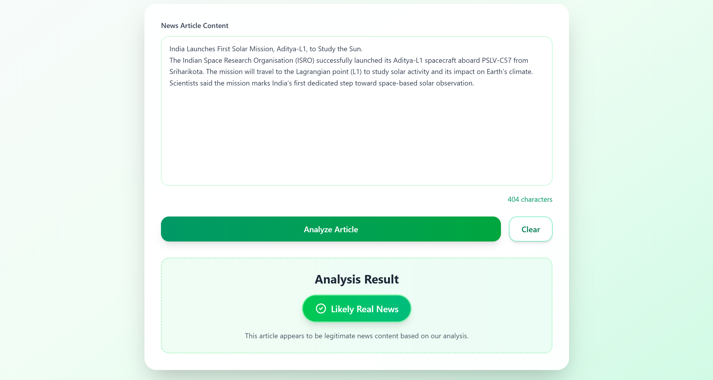

# Fake News Detector

Detect fake news and verify the authenticity of news articles using a **Multinomial Naive Bayes** classifier with **TF-IDF vectorization**.  
The backend is built with **Flask**, while the model is developed using **scikit-learn, pandas, numpy, matplotlib**.  
The frontend is implemented with **React** and styled with **Tailwind CSS**.  
The trained model achieves an accuracy of around **~89%** on the test dataset.

---

## Screenshots
**Main Interface:**


**News Analysis Interface:**


**Detection Result:**



This repository contains:

- `server/` – Flask API that loads the trained model and provides prediction endpoints.
- `client/` – React + Vite UI with Tailwind CSS styling for news article analysis.
- `model/` – Jupyter notebook with data preprocessing, model training, and evaluation.
- `server/artifacts/` – Trained model and supporting files used by the server.

---

## Quick overview

- The Flask server exposes two endpoints:
  - `POST /predict` — analyze news article content. Accepts JSON with article text and returns prediction (0 for real, 1 for fake).
  - `GET /health` — health check endpoint to verify server status.

- The React client provides an intuitive interface for pasting news articles and displaying analysis results with color-coded indicators.

---

## Requirements

- Python 3.10+ (server)
- Node.js 18+ and npm (client)
- On Windows PowerShell use the commands shown in the next section.

---

## Server — setup & run

1. Open a terminal and change into the `server` directory:

```powershell
cd "c:\Users\dhruv\OneDrive\Desktop\fake news pred\server"
```

2. Create and activate a virtual environment (Windows PowerShell):

```powershell
python -m venv venv
.\venv\Scripts\Activate.ps1
```

3. Install dependencies:

```powershell
pip install -r requirements.txt
```

4. Run the API:

```powershell
python app.py
```

By default the Flask server listens on `http://localhost:5000`.

**Notes:**

* The server expects model artifacts in `server/artifacts/` directory.
* Ensure the pickle file `fakenews_detector.pickle` and `columns.json` are present in the artifacts folder.

---

## Client — setup & run

1. Change into the `client` directory:

```powershell
cd "c:\Users\dhruv\OneDrive\Desktop\fake news pred\client"
```

2. Install node packages and run the dev server:

```powershell
npm install
npm run dev
```

The Vite dev server will start (default port 5173). Open the address shown in the terminal (typically `http://localhost:5173`).
Ensure the Flask server is running at `http://localhost:5000` so the client can make API requests.

---

## API details

### POST `/predict`

* **Description:** Analyze news article for authenticity.
* **Content-Type:** `application/json`
* **Required JSON fields:**
  * `content` (string) — The news article text to analyze
* **Response:** JSON with `prediction` (0 for real news, 1 for fake news).

### GET `/health`

* **Description:** Health check endpoint.
* **Response:** JSON with `status: "ok"`.

**Example (PowerShell) request:**

```powershell
$body = @{
    content = "The government announced new policies to improve the economy."
} | ConvertTo-Json

Invoke-RestMethod -Uri http://localhost:5000/predict -Method Post -Body $body -ContentType 'application/json'
```

**Example response:**

```json
{
    "prediction": 0
}
```

---

## Model & artifacts

* **Model:** Multinomial Naive Bayes with TF-IDF vectorization (achieves ~89% accuracy).
* **Dataset:** WELFake Dataset with comprehensive preprocessing and cleaning.
* **Features:** 
  - TF-IDF vectorization with n-grams (1,2)
  - Maximum features: 20,000
  - Minimum document frequency: 5
  - English stop words removal

* `server/artifacts/fakenews_detector.pickle` — trained pipeline including TF-IDF vectorizer and Naive Bayes classifier.
* `server/artifacts/columns.json` — column metadata used by the model.

**Model Pipeline:**
1. **Text Cleaning:** Remove URLs, HTML tags, special characters, normalize whitespace
2. **TF-IDF Vectorization:** Convert text to numerical features
3. **Classification:** Multinomial Naive Bayes for final prediction

If you want to retrain or inspect the model, see `model/model.ipynb` and ensure you have the WELFake dataset.

---

## Features

### Backend (Flask)
- RESTful API with CORS support
- Efficient model loading and caching
- Text preprocessing utilities
- Error handling and validation

### Frontend (React + Tailwind CSS)
- Modern, responsive design with red/green color scheme
- Real-time character counting
- Loading states and smooth animations
- Intuitive result display with color-coded indicators:
  - 🔴 **Red:** Likely fake news (warning)
  - 🟢 **Green:** Likely real news (safe)
- Glass morphism effects and gradient styling

### Model Performance
- **Accuracy:** ~89% 
- **Response Time:** ~0.3 seconds average

---

## Development notes

* Server utilities are in `server/utils.py` (text cleaning, model loading, prediction functions).
* Flask routes are in `server/app.py`.
* Frontend entry: `client/src/main.jsx`, components under `client/src/components/`.
* Styling: Tailwind CSS with custom color scheme and modern UI components.

---

## Text Preprocessing

The model includes comprehensive text cleaning:

```python
def clean_text(text):
    text = str(text).lower()
    text = re.sub(r"http\\S+|www\\S+", " ", text)   # Remove URLs
    text = re.sub(r"<.*?>", " ", text)              # Remove HTML
    text = re.sub(r"[^a-z0-9\\s]", " ", text)       # Keep only letters/numbers
    text = re.sub(r"\\s+", " ", text)               # Normalize spaces
    return text.strip()
```

---

## Contributing

Small fixes and improvements are welcome.
For model changes, include training notebooks and updated artifacts.
For frontend changes, maintain the red/green color scheme and ensure responsive design.
